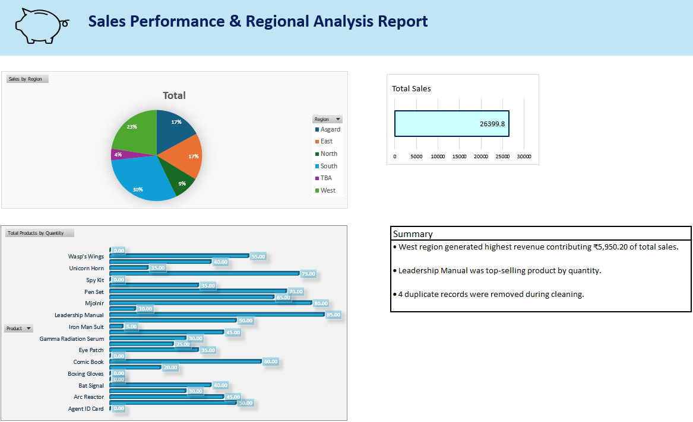

# Sales Performance & Regional Analysis Report

End-to-end data cleaning and sales analysis project built using Microsoft Excel.

## Overview
This project demonstrates data cleaning, structuring, and dashboard creation using Excel.

## Key Insights
- West region generated the highest revenue (₹5,950.20).
- Leadership Manual was the top-selling product by quantity.
- 4 duplicate transaction records were removed during cleaning.

## Tools Used
- Microsoft Excel
- Pivot Tables
- Data Validation
- TRIM, IFERROR, Find & Replace
- 
## Dashboard Preview

